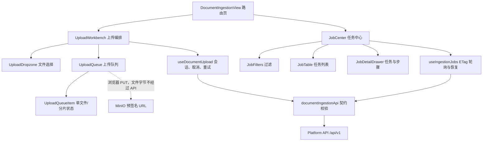

# M02 Web 组件边界图

> 本图在编写 Vue 组件前冻结，用于约束路由页、业务组件、Composable 与 API Adapter 的职责。

## 状态所有权

- `DocumentIngestionView`：只负责页面布局和空间选择，不保存上传细节。
- `useDocumentUpload`：保存上传会话、XHR、分片重试次数和本机恢复快照。
- `useIngestionJobs`：保存查询条件、列表、当前详情与后端事件游标。
- `UploadQueueItem`：通过 props 接收文件状态，通过 emits 发出取消/重试意图，不直接请求 API。
- `JobDetailDrawer`：只呈现后端返回的 `stagePercent/overallPercent`；值为 `null` 时使用不确定进度。
- `documentIngestionApi`：统一注入认证信息，并用 Zod 校验所有响应。

## 刷新恢复边界

浏览器只在 `localStorage` 保存 `uploadSessionId/fileId/fileName/size` 等非敏感定位信息。页面刷新后向后端重新查询会话或任务；预签名 URL 不落盘，过期后重新申请。已经交给 MinIO 的字节进度无法从浏览器精确恢复，因此显示“等待续传”，而不是构造百分比。
