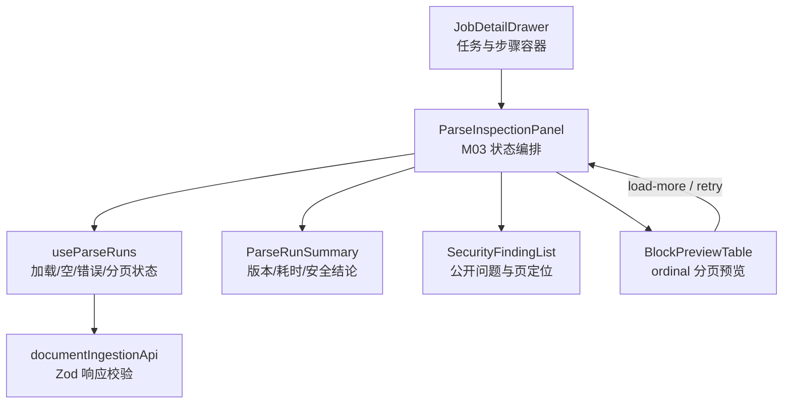

# M03 Web 组件边界图

> 先定义边界再写 Vue，防止任务详情抽屉继续膨胀成同时请求、转换、展示和处理交互的巨型组件。

## 数据和事件方向

| 组件                   | Props 输入          | Emits 输出           | 自身职责                                  | 明确不负责           |
| ---------------------- | ------------------- | -------------------- | ----------------------------------------- | -------------------- |
| `JobDetailDrawer`      | `job`、`events`     | `close`、`cancel`    | 任务级布局，向下传 `documentVersionId`    | 不请求 Parse Run     |
| `ParseInspectionPanel` | `documentVersionId` | 无                   | 使用 composable 组合运行详情和 Block 页面 | 不自行拼 HTTP        |
| `ParseRunSummary`      | `run`               | 无                   | 安全结论、Provider 修订、OCR 页数、耗时   | 不加载数据           |
| `SecurityFindingList`  | `issues`            | 无                   | 空态和页级问题展示                        | 不展示原始供应商响应 |
| `BlockPreviewTable`    | `blocks`、分页状态  | `load-more`、`retry` | 表格/Slide/页/bbox 的可定位预览           | 不持有游标           |

## 必须覆盖的 UI 状态

- 首次加载：骨架屏，不能把“尚未返回”误显示为“没有解析记录”。
- 空状态：M03 尚未执行或旧任务没有 Parse Run。
- 错误状态：显示公开错误并提供重试；403 使用“无权查看”。
- 运行中：展示 Profile 与当前已知事实，Block 区暂时为空。
- 人工复核/拒绝：安全色与普通 Provider 故障明确区分。
- 成功：按 ordinal 预览 Block，超过 100 条显式加载更多。
- 无 OCR：显示 0 页，不把它解释为 OCR 故障。

## 视觉方向

延续 M02 的“编辑部运营台”语言：暖灰纸张背景、深墨标题、橙色行动点。M03 使用紧凑的事实带和结构化表格，不新增泛化卡片瀑布；安全拒绝用低饱和红，人工复核用琥珀色，成功用墨绿色。
