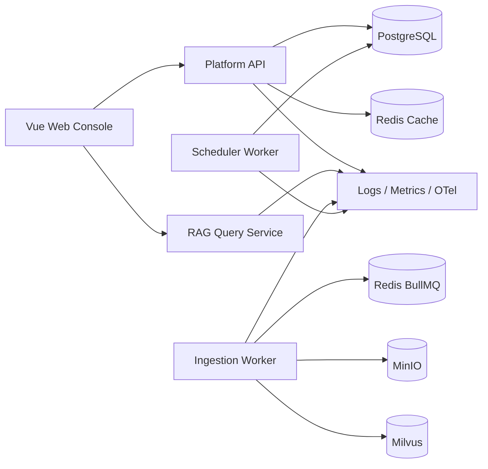

# M00 架构与数据流

## 进程结构



管理面和查询面分开，是为了让大批上传或后台治理不抢占在线问答资源。两个 Worker 的探针端口只服务健康与指标，后续消费者在同一进程注册。

## 依赖方向

```text
contracts ← domain ← application ← adapters ← apps
```

箭头表示“可以依赖”。contracts 必须是纯协议；domain 只放业务不变量；application 编排用例；adapter 把 PG/Milvus/模型 SDK 翻译成端口；apps 只做装配和启动。反向依赖会让一次 SDK 更换穿透全系统。

## 正常 HTTP 链路

1. OpenTelemetry 在 `main.ts` 第一条 import 注册 Node 自动埋点。
2. Nest 创建应用并通过 Zod 加载配置，错误则拒绝启动。
3. RequestContext 中间件校验或生成 Request ID，并读取活跃 Trace ID。
4. Controller 调用 HealthService；readiness 并行执行五个协议探针。
5. 响应 Envelope 和响应头带关联 ID；Pino 日志与 Prometheus 指标记录同一请求。

## 失败链路

外部依赖异常会被探针转换成脱敏的 `down`，readiness 返回 503。未捕获异常进入全局 Filter，映射为稳定错误码；原异常只进入经过脱敏的结构化日志，不回传 SDK 堆栈或连接串。
