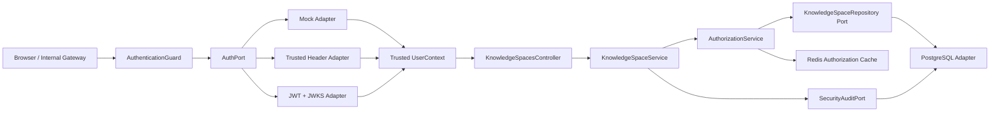
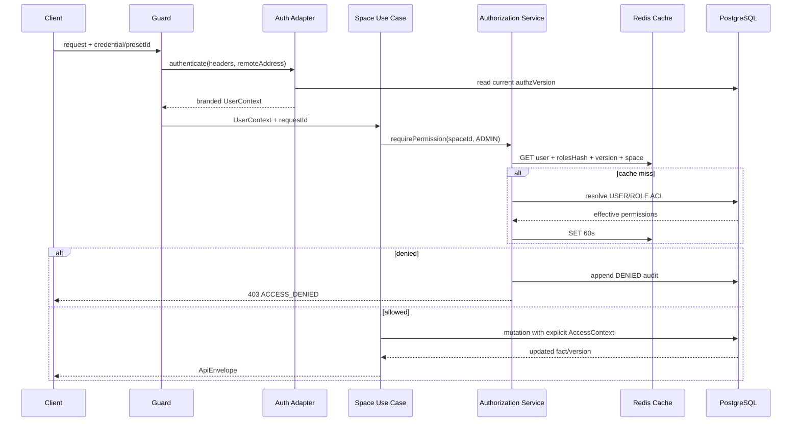

# M01 架构与数据流

## 分层关系

依赖方向仍是 Domain → Application Ports ← Adapters。Platform API 的 M01 Module 是 Composition Root，只有它知道具体使用 PostgreSQL、Redis 和哪种 Auth Adapter。

## 一次受保护请求

## 撤权闭环

撤权事务锁定空间，删除 ACL，检查至少保留一个 ADMIN，递增 `policyVersion`，写策略快照，再递增 `authorization_state.version`。事务提交后应用服务递增 Redis 缓存代次并写审计。下一个请求会得到新的 `authzVersion`，不可能复用旧 Key。

## 侧路资源重鉴权

文档正文、引用预览、历史消息、检索候选和导出都可能绕过主列表过滤。M01 先建立 `protected_resource_spaces` 反查索引和 `requireResourcePermission`：资源 ID → 当前 spaceId → 当前 ACL。后续模块接入具体资源时复用它，不信任旧 Run 中保存的授权结果。
