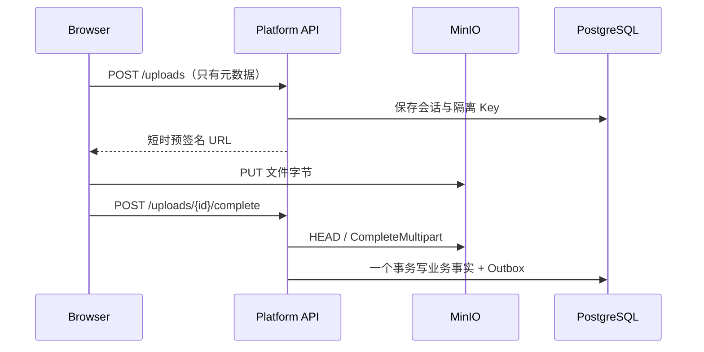

# M02 概念：把“上传文件”拆成可恢复的企业事实

## 1. M02 真正解决什么问题

普通 Demo 的上传通常是一个 `multipart/form-data` 接口：浏览器把文件交给 API，API 保存文件后立刻开始解析。企业上线时，这种写法会同时遇到四类问题：

1. 200 MiB 文件经过 API，API 同时承担入口流量和出口流量，实例内存、连接数、临时磁盘都容易耗尽。
2. 文件保存成功、数据库写入失败时，客户端不知道应该重传文件还是只重试数据库操作。
3. 解析 Worker 崩溃后，系统只看到“处理中”，不知道由谁处理、是否还能恢复。
4. 页面刷新后，浏览器内存中的进度消失，用户无法判断文件和任务到底处于什么状态。

M02 的答案不是“再加几个状态字段”，而是把一次接入拆成三层事实：

```text
浏览器上传事实：UploadSession / UploadFile
业务内容事实：Document / DocumentVersion / DocumentFile
异步执行事实：IngestionJob / JobStep / JobEvent / Outbox
```

## 2. Document、Version、File 为什么不能合成一张表

- `Document` 是用户认知中的逻辑文档，例如“员工报销制度”。它有标题、所属空间和业务版本号。
- `DocumentVersion` 是一次业务内容版本，例如 2026 年修订版。`optimisticVersion` 用于并发控制。
- `DocumentFile` 是该版本对应的原始对象事实，包括 bucket、随机 object key、大小、MIME、ETag 和可用 Hash。

如果三者合在一张表，后续“同一文档上传新版本”“Parser 升级后重新处理旧文件”“保留旧索引用于回滚”都会互相覆盖。

## 3. versionNumber 与 contentRevision 的区别

这是面试最容易追问的点。

- `versionNumber`：业务内容真的换了，例如用户上传了新版制度文件。
- `contentRevision`：原文件没变，但 Parser、OCR、Chunker 或策略升级，需要重新生成派生事实。

重处理只增加 `contentRevision`，旧 Job、旧 Block/Chunk（后续模块）继续保留。这样才能回答：“半年前那个答案使用的是哪个解析实现产生的内容？”

## 4. 为什么使用预签名 URL

Platform API 根据当前用户的空间 `WRITE` 权限创建会话，然后为服务端生成的随机对象 Key 签名。浏览器拿到 URL 后直接 PUT MinIO：



预签名 URL 不是永久凭证：它绑定 bucket、objectKey、HTTP 方法、过期时间；Multipart 还绑定 `uploadId` 与 `partNumber`。

## 5. 为什么原始文件名不能进入对象路径

原始文件名可能包含：

- `../../` 或反斜杠等路径穿越片段；
- 同名覆盖；
- 控制字符和操作系统非法字符；
- “薪资调整-张三.pdf”之类敏感业务名称。

本项目只把净化后的文件名作为展示元数据，Key 固定为：

```text
spaces/{spaceId}/uploads/{uploadSessionId}/files/{uploadFileId}
```

## 6. Outbox 解决的不是“消息重复”，而是“双写丢失”

如果 API 先提交 PG，再发 Redis，提交后进程崩溃会导致“有文档、没任务”。如果先发 Redis，再提交 PG，会导致 Worker 找不到业务事实。

Outbox 把“需要发消息”也保存为同一 PG 事务事实。Scheduler 稍后领取并投递。消息可能重复，所以还需要：

- Publisher：`FOR UPDATE SKIP LOCKED`，多实例不领取同一行；
- BullMQ：`jobId = outboxEventId`；
- Consumer：Inbox 收据与副作用同事务，重复事件返回 no-op。

这叫 at-least-once delivery + idempotent consumer，而不是虚构 exactly-once 网络。

## 7. Lease、Heartbeat 与重试

Worker 领取任务时写：

```text
leaseOwner = worker-a
leaseExpiresAt = now + 120s
heartbeatAt = now
```

处理期间只有 `worker-a` 能更新进度并续租。Scheduler 看到 `RUNNING + leaseExpiresAt <= now`，说明 Worker 失联：

- 未超过尝试上限：回到 `QUEUED`，`attempt + 1`；
- 达到上限：进入 `WAITING`，交给人工处理。

## 8. 真实进度为什么允许 null

OCR 开始前可能不知道总页数，Parser 开始前也可能不知道总 Block 数。此时 `totalUnits=null`、`stagePercent=null`。前端显示不确定进度动画，不显示“37%”这样的假数字。

总体进度来自版本化步骤权重：当前步骤总量未知时只计算已经完成的权重，不按时间猜测。
