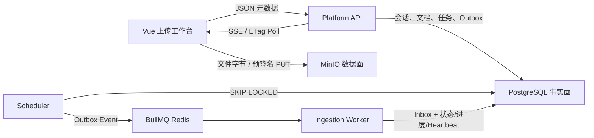

# M02 架构：控制面、数据面和事实面的分离

## 1. 三个数据平面



- 控制面：Platform API 决定谁能上传、上传到哪里、何时完成。
- 数据面：MinIO 承载大字节，不让 API 成为流量中继。
- 事实面：PostgreSQL 保存可审计、可恢复、可查询的真相。

## 2. 分层与依赖方向

```text
contracts
  ↑
ingestion-core（纯状态机、进度、ID、净化）
  ↑
application（用例 + Port）
  ↑
persistence-pg / persistence-minio / persistence-redis
  ↑
platform-api / scheduler-worker / ingestion-worker
```

关键约束：`DocumentIngestionService` 只依赖 `ObjectStoragePort` 与 `DocumentIngestionRepository`，不知道 MinIO SDK、SQL、BullMQ 或 NestJS。

## 3. 上传会话时序

### 小文件

1. 校验批量数量、单文件大小和空间 `WRITE` 权限。
2. 生成 sessionId/fileId 和随机 objectKey。
3. 保存 `SINGLE` 计划，并返回短时 PUT URL。
4. 浏览器 XHR PUT，利用 `upload.progress` 展示真实字节进度。
5. Complete 接口 HEAD 后提交 PG 事务。

### 大文件

1. 超过阈值后调用 `initiateNewMultipartUpload`。
2. 浏览器按需请求 part URL；一次失败只重试该 part。
3. 每次 part PUT 保存真实 ETag。
4. Complete 提交全部 `{partNumber, etag}`，服务端排序后合并。
5. 合并后再 HEAD，核对最终对象。

## 4. 最危险的故障窗口

```text
T1  MinIO CompleteMultipart 成功
T2  网络响应丢失或 PG 事务失败
T3  客户端重试 Complete API
```

如果 T3 再次调用 CompleteMultipart，旧 uploadId 可能已失效。当前实现先 HEAD：

- HEAD 已存在且事实匹配：跳过合并，直接重试 PG 事务；
- HEAD 不存在：执行合并；
- 合并返回错误但第二次 HEAD 成功：把它视为响应不确定但合并已成功。

## 5. 上传完成事务边界

同一事务包含：

1. 锁定 `upload_sessions + upload_files`；
2. 检查是否已经完成，重复请求直接读取既有事实；
3. 插入 Document、DocumentVersion、DocumentFile；
4. 插入 IngestionJob 和 10 个 JobStep；
5. 插入首条 JobEvent 与 Outbox Event；
6. 建立 `protected_resource_spaces` 反查索引；
7. 更新空间文档计数、上传文件引用和会话状态。

任何一步失败都会 ROLLBACK。数据库唯一约束再提供第二道幂等保护。

## 6. 任务标识

```text
Job:
ingest:{documentVersionId}:revision:{contentRevision}:pipeline:v{pipelineVersion}

Step:
ingest:{documentVersionId}:revision:{contentRevision}:step:{stepName}:v{stepVersion}
```

稳定 ID 让 API 重试、Outbox 重投、BullMQ 去重和 Worker 重启都定位同一业务工作，而不是每次产生新 UUID。

## 7. 事件恢复

`ingestion_job_events.id` 是 PG `bigserial`，对每个 Job 查询时单调递增：

- SSE：客户端发送 `Last-Event-ID`，服务端从 `id > cursor` 补发；
- Poll：客户端发送 `after` 与 `If-None-Match`，无变化返回 304；
- 页面刷新：任务详情来自 PG，事件游标重新从 0 或本地已知位置读取。

事件只传已持久化事实；它不是业务真相本身。

## 8. 中型规模默认值

| 配置                               | 默认值 | 意义                     |
| ---------------------------------- | ------ | ------------------------ |
| `UPLOAD_MAX_FILES_PER_SESSION`     | 100    | 防止单请求无限扩张       |
| `UPLOAD_MAX_FILE_BYTES`            | 2 GiB  | 单文件业务上限           |
| `UPLOAD_MULTIPART_THRESHOLD_BYTES` | 16 MiB | 大于此值切 Multipart     |
| `UPLOAD_PART_SIZE_BYTES`           | 8 MiB  | 平衡请求数和失败重传成本 |
| `UPLOAD_SESSION_TTL_SECONDS`       | 3600   | 会话最长可写时间         |
| `INGESTION_LEASE_SECONDS`          | 120    | Worker 失联判定窗口      |
