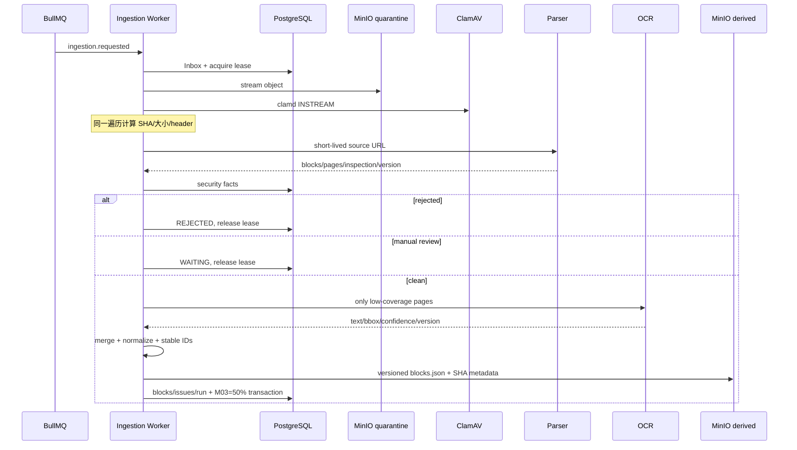

# 02｜架构：从隔离对象到版本化派生快照

## 关键边界

- `libs/parser-core`：无 I/O 的格式识别、安全策略、OCR 选页、Block 规范化。
- `libs/application`：Port 和 `DocumentProcessingService` 编排，不依赖具体 Adapter。
- `libs/file-processing-providers`：ClamAV、Docling、内网 HTTP 和 Fixture。
- `libs/persistence-*`：对象流、派生对象与 PG 事务。
- `apps/ingestion-worker`：消息生命周期、lease 续租和 Composition Root。
- `apps/platform-api/src/m03`：只读管理接口，不在 API 进程解析文件。

## 两个幂等层次

1. `document_parse_runs.job_id UNIQUE`：同一 Job 重试恢复同一运行事实，不创建无限历史垃圾。
2. derived Key 包含 `documentVersionId/contentRevision/parserProfileId`，对象 metadata 保存 SHA；重试时 SHA 相同直接复用，不相同才覆盖同一版本语义路径。

内容修订变化会生成新路径，因此“重处理”不会篡改旧内容修订的可追溯结果。
