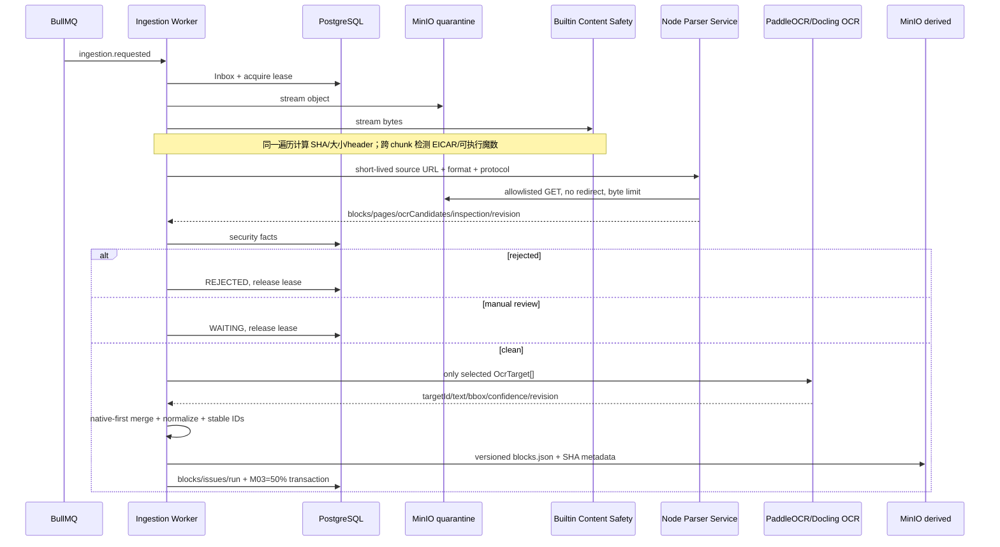

# 02｜架构：从隔离对象到版本化派生快照

## 关键边界

- `libs/parser-core`：无 I/O 的格式识别、安全结论、OCR Target 选择、Block 规范化。
- `libs/document-parser-core`：九类真实格式算法和 OOXML 安全读取；不依赖 NestJS、MinIO、PG 或 OCR SDK。
- `apps/document-parser-service`：NestJS HTTP 边界、来源 URL 白名单、下载上限、健康/指标和 Registry 组装。
- `libs/application`：Port 和 `DocumentProcessingService` 编排，不依赖具体 Parser/Scanner/OCR。
- `libs/file-processing-providers`：内置扫描、Node Parser HTTP、Docling、内网 OCR HTTP 和 Fixture Adapter。
- `libs/persistence-*`：对象流、派生对象与 PG 事务。
- `apps/ingestion-worker`：消息生命周期、lease 续租和 Composition Root，不承载格式解析算法。
- `apps/platform-api/src/m03`：只读管理接口，不在 API 进程解析文件。

## 为什么是两个进程

Worker 持有任务状态、对象存储端口和数据库事务；Parser 处理高 CPU/高内存且面对畸形文件。拆进程后，Parser OOM/超时不会直接拖垮队列消费者，容器可以独立限制内存、CPU、PID、临时盘和网络。业务层只依赖 `ParserPort`，所以内网替换 Endpoint 不改编排代码。

## 两层安全而不是“一个扫描器包打天下”

1. 内置流式预检在 Parser 前拒绝 EICAR、可执行文件魔数和超限流，证明输入被完整消费且能响应取消。
2. 格式 Parser 理解 PDF/OOXML/HTML 结构，检查宏、ActiveX、嵌入对象、外链、加密、ZIP 路径/条目/压缩比、页、像素和表格规模。

内置规则没有病毒库，不能发现所有恶意样本。生产安全还依赖隔离 Bucket、来源权限、只读非 root 容器、无公网出站、依赖 SCA/SBOM 和可选企业扫描 Port。

## 两个幂等层次

1. `document_parse_runs.job_id UNIQUE`：同一 Job 重试恢复同一运行事实，不创建无限历史垃圾。
2. derived Key 包含 `documentVersionId/contentRevision/parserProfileId`，对象 metadata 保存 SHA；重试时 SHA 相同直接复用，不相同才覆盖同一版本语义路径。

内容修订变化会生成新路径，因此重处理不会篡改旧内容修订的可追溯结果。
