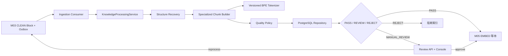

# 02｜架构与边界

## 1. 组件图

## 2. 四层职责

| 层       | 主要位置                                        | 可以做什么                            | 不应做什么              |
| -------- | ----------------------------------------------- | ------------------------------------- | ----------------------- |
| 契约     | `libs/contracts/src/knowledge-processing.ts`    | Zod 运行时校验、共享 DTO              | 权限、SQL、Chunk 算法   |
| 纯算法   | `libs/chunking/src`                             | 结构恢复、分块、token、去重、质量裁决 | Nest、PG、Redis、Milvus |
| 应用编排 | `libs/application/src/knowledge-processing*.ts` | 调用顺序、Port、错误边界              | 拼 SQL、读取供应商配置  |
| Adapter  | `libs/persistence-pg`、`apps/*`                 | 事务、HTTP/队列映射、依赖注入         | 重新实现领域规则        |

这使 Golden 测试不需要启动 Nest 或数据库，也使内网切换 Tokenizer/Provider 时不会污染业务规则。

## 3. 事实与版本

一次 `knowledge_processing_run` 固定：

- `contentRevision`；
- `chunkerProfileId/chunkerRevision`；
- `tokenizerProfileId/tokenizerRevision`；
- `qualityRuleVersion`。

Chunk、关系、质量报告都绑定该 Run。历史结果不可因当前配置变化而被重新解释。M05 只允许读取 `eligible_for_index=true` 的 Child，而资格必须来自自动 PASS 或合法人工批准。

## 4. 事务边界

M03 完成时，在写 Parse Run/Block 的同一事务内把 `CHUNK` 步骤排队并写 `ingestion.knowledge_processing.requested` Outbox。M04 完成时，在一个事务内写入 Run、Chunk、关系、质量报告、发现项和任务步骤状态。

人工审核也是事务：行锁报告、校验 `expectedVersion`、追加不可变 review/audit、更新索引资格；重处理还会原子创建 revision、完整任务步骤和 Outbox。任何一步失败都会整体回滚。

## 5. 权限边界

Controller 从认证 Guard 获取可信 `UserContext`；Application 先通过 `AuthorizationService` 要求 `REVIEW`。Repository 再根据文档所属 Space 做一次直接 ACL 防御，防止未来某个调用方绕开应用服务。默认拒绝，客户端提交的 ID 不能扩大权限。

## 6. 可观测性

Worker 延续 M02 的 Request/Trace、Inbox 幂等和 Lease fencing，并增加：

- `rag_m04_processing_total{result}`；
- `rag_m04_processing_duration_seconds{result}`。

标签只用有限枚举结果，不放 userId、文档 ID、正文、审核原因或 URL，避免指标基数爆炸和敏感数据泄漏。
