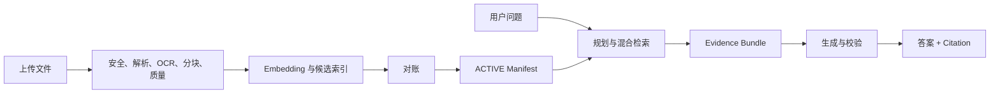

# 01：从一份文件到一个可信答案的完整闭环

## 1. 先区分两条主链路

RAG 有两条时间尺度完全不同的流水线：

- 入库链路：分钟级或小时级，把“文件”生产成“可检索、可发布的知识”。
- 问答链路：秒级，把“用户问题”生产成“有证据、受权限约束的答案”。

两条链路在 `ACTIVE Manifest` 处交汇。入库只有发布成功的知识才能被查询；查询必须冻结自己使用的 Manifest，不能边回答边追逐正在变化的索引。

## 2. 入库链路：文件如何变成知识

### 2.1 创建上传会话

浏览器先把文件名、大小、MIME、空间等元数据交给 Platform API。API 做权限和配额校验，生成随机对象 Key 和短时预签名 URL。

为什么不让文件字节经过 Nest API？大文件会长期占用 API 连接、内存和带宽。预签名上传让浏览器直接把字节送进 MinIO，API 只管理“谁有资格、可以传什么、多久有效”。

### 2.2 单文件与 Multipart

小文件一次 PUT；大文件拆 Part。Multipart 的价值不是“更快”三个字，而是失败时只重传坏掉的 Part。每个 Part 的 ETag 会被记录，Complete 时服务端按序合并。

最危险的窗口是 MinIO 已合并成功，但 HTTP 响应丢失。客户端重试 Complete 时，系统先 HEAD 对象：事实一致就只补数据库事务，不重复合并。这是把“网络结果未知”变成“查询真实副作用后决定”。

### 2.3 完成上传的数据库事务

一个事务同时创建 Document、DocumentVersion、DocumentFile、IngestionJob、十个 JobStep、首条 JobEvent、Outbox 和权限反查关系。任何一条失败全部回滚。

这里的关键概念是：

- Document：业务上的一份文档，例如《差旅制度》。
- DocumentVersion：这份文档的第几版原始文件。
- contentRevision：同一原文件用新版 Parser/Chunk 策略重处理的版本。
- embeddingRevision：同一内容用新版 Embedding 重建的版本。

把三种版本拆开，才不会“换个模型就伪造出一版业务文件”。

### 2.4 Transactional Outbox

数据库事务里不能安全地同时承诺“PG 写成功”和“Redis 消息一定成功”，因为它们没有共同事务。项目先把待发事件写入 `outbox_events`，Scheduler 再投递 BullMQ并标记发送结果。

可能重复，但不会丢；消费者必须幂等。企业系统更愿意处理可识别的重复，也不能接受静默丢任务。

### 2.5 Worker 领取和续租

BullMQ 把事件交给 Ingestion Worker。Worker 先用稳定 Job ID/Receipt 判断是否处理过，再从 PG 领取 Lease。Lease 相当于“这项工作暂时归我”，Heartbeat 相当于“我还活着”。进程崩溃后 Lease 到期，别的 Worker 可以接管。

BullMQ 的锁负责 Redis 消费层；PG Lease 负责业务事实层。两者解决的不是同一个问题，所以都需要。

### 2.6 安全检查、格式识别和 Parser

系统不相信扩展名。它检查 Magic Bytes、ZIP/OOXML 结构、宏、嵌入对象、外链、压缩比、像素和表格规模，再由格式 Registry 选择 Parser。

项目内置 PDF、DOCX、XLSX、PPTX、图片、HTML、Markdown、Text、CSV Parser。Parser 输出统一 `DocumentBlock`，保留原文、页码/Sheet/Slide、bbox、表格结构、置信度和内容 Hash。

Parser 不能直接生成最终 Chunk，因为“读出文件结构”和“为检索设计知识单元”是两个变化频率不同的职责。

### 2.7 选择性 OCR

不是看到 PDF 就整本 OCR。项目按页计算文本覆盖率，只对无原生文本、低覆盖、乱码页、截图或嵌入图片创建 OCR Target。

好处：降低推理成本和等待时间，避免 OCR 结果覆盖可靠的原生文本，同时仍能恢复扫描页内容。OCR 返回结果必须与请求的 targetId 一一对应，不能越权返回未请求页面。

### 2.8 Normalize、Chunk 和关系

Normalize 清理编码、空白和可控噪声，但保留 originalText。Chunk 阶段根据标题、段落、表格和 token 预算生成 Parent/Child：

- Parent 保存足够上下文，适合给模型阅读。
- Child 更短、更聚焦，适合向量召回。
- `chunk_relations` 保存 Parent、Neighbor、Source Block 等关系。

查询时先用 Child 找得准，再扩到 Parent/Neighbor 读得懂，这叫 Small-to-Big Retrieval。

### 2.9 Quality Gate

系统检查乱码率、空内容、OCR 置信度、结构完整性、Chunk 数和其他异常。严重问题阻止发布；可疑问题进入人工审核；合格才进入 Embedding。

如果没有质量门禁，垃圾文本会“成功”进入向量库，最后表现成看似模型能力差，实际是知识生产线坏了。

### 2.10 Embedding、索引、对账和发布

Worker 批量调用 Embedding，逐项处理成功/失败，复用相同内容 Hash 的向量。向量先写候选 Milvus Collection，不直接覆盖在线集合。

随后对账：期望数量、实际数量、主键、内容 Hash、Profile、维度和固定查询都正确，才把候选 Manifest 原子切成 ACTIVE。旧 Manifest 变为 SUPERSEDED，可以快速回退。

## 3. 问答链路：问题如何变成可信答案

### 3.1 认证、授权和会话

可信认证层提供 `userId + roles`。应用根据角色映射和 Resource ACL 得到可访问空间。问题正文用 AES-256-GCM 加密保存，日志不记录完整问题。

### 3.2 创建 Run 并冻结快照

Run 创建时保存：用户、角色、目标空间、ACTIVE Manifest、Embedding/Reranker/LLM Profile、Prompt、Policy、Flow Version、Deadline 和幂等键。

冻结的原因是一个 Run 不能前半段用旧 Embedding，后半段突然换新模型；否则无法重放、审计和比较评测结果。

### 3.3 查询规划 Graph

`route_query` 先区分知识问题、闲聊、需澄清和拒绝类输入。知识问题进入 `build_plan`；复杂问题可以 `rewrite_query`，随后生成 Query Embedding。

`hybrid_retrieve` 并行进行 Dense/Sparse 召回，用 Weighted RRF 合并；然后 `source_recheck` 回 PostgreSQL 做权限和版本复核；`assess_retrieval` 判断证据是否够，不够时最多调整一次计划；最后 `diversify` 限制同一文档和章节霸榜。

### 3.4 Reranker

召回要“别漏掉”，Reranker 要“把最相关的排前面”。它读取 query 与候选正文做更细的相关性判断，通常只处理几十条候选，避免成本爆炸。

Reranker 超时是否降级取决于业务：普通知识问答可保留融合排序并标记 degraded；法务、高风险回答可以 fail-closed。

### 3.5 Evidence Bundle

候选经过 Parent/Neighbor 扩展，整理成证据项：来源文档、版本、页码/章节、内容 Hash、权限复核事实和稳定 Citation ID。系统还会检查证据不足、冲突、过期和敏感规则。

Evidence Bundle 是检索和生成之间的防火墙。模型只能看到预算内、已授权、可引用的证据，而不是直接看到 Milvus 原始结果。

### 3.6 上下文预算和生成

Context Builder 按 token 预算、公平性、证据等级和文档上限选择材料。Prompt 要求模型输出结构化 Draft：答案、Claim、每个 Claim 使用的 Citation ID、置信度和拒答原因。

不能让模型自由编 Citation。允许引用的 ID 白名单来自 Evidence Bundle，模型输出中不存在的 ID 会被拒绝。

### 3.7 答案校验

校验至少包括：

- 引用仍对应当前 Run 冻结的来源；
- Claim 有引用覆盖；
- 关键数字和确定性计算能由证据支持；
- 引用没有越权或版本漂移；
- 规则 Validator 通过；
- 可选 Semantic Judge 判断语义蕴含；
- 低置信、证据不足或冲突时安全拒答。

最终答案和 Citation、Validation Report 一起入 PG，再以顺序事件经 Redis Stream/SSE 发给前端。

## 4. 删除、撤权和更新也属于闭环

“能新增”不等于闭环：

- 文档更新：创建新 DocumentVersion/contentRevision，构建候选 Manifest 后再发布。
- 撤销权限：数据库授权立即生效，查询回源复核会挡住旧 Milvus 残留。
- 删除文档：先撤出新 Manifest，再按保留策略清理对象、Chunk、向量和审计事实。
- 更换 Embedding：新 Profile、新 Collection、新 Manifest、Golden/Canary、原子切换；不能写进旧维度集合。
- 回滚：恢复历史已验证 Manifest，而不是现场拼 Collection 名。

这就是知识从创建、使用、更新到退出的完整生命周期。

## 5. 一分钟讲法

> 我们把 RAG 分成离线知识生产和在线答案生产。文件通过预签名上传进入隔离桶，PG 事务同时落版本、任务和 Outbox，BullMQ 驱动带 Lease 的 Worker 完成安全解析、选择性 OCR、Parent/Child 分块、质量门禁、Embedding 和候选索引；只有对账通过才原子发布 Manifest。在线问答冻结用户权限和索引/模型快照，经 LangGraph 完成混合召回、PG 回源授权、RRF、多样性、Rerank、证据扩展和路由，再做结构化生成、引用白名单和规则/语义校验。PG 保存真相，Redis 只做缓存、队列和事件流，MinIO 存字节，Milvus 做召回，因此系统可以审计、恢复、回滚和离线切换 Provider。
