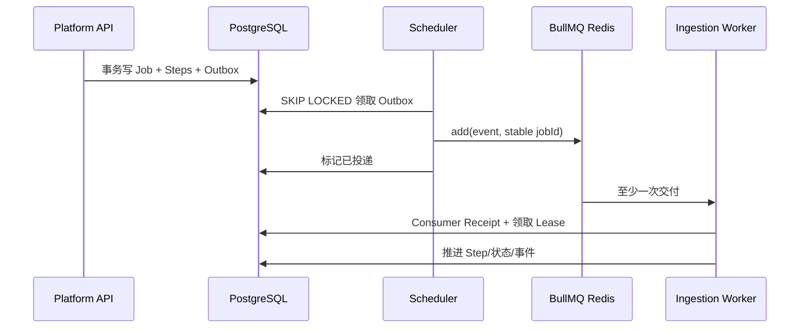

# 03：PostgreSQL、Redis、BullMQ、MinIO 与 Milvus

## 1. 先用一个仓库比喻

把系统想成一家大型档案加工厂：

- PostgreSQL 是总账和工单系统：什么业务事实发生过，以它为准。
- MinIO 是档案库：保存原文件和派生大对象。
- BullMQ 是传送带调度器：通知工人下一件做什么。
- Redis Cache 是便签和快速索引：为了快，可过期、可重建。
- Redis Stream 是实时广播栏：让前端尽快看到 Run 事件。
- Milvus 是按语义找资料的检索目录：擅长近邻搜索，不是业务总账。

把职责混用会出事故：用 Redis 当唯一工单，重启后任务事实没了；用 Milvus 判断权限，索引延迟时越权；把文件塞 PG，备份和 IO 被大字节拖垮。

## 2. PostgreSQL：唯一业务事实源

### 2.1 保存什么

主要事实包括：

- 身份权限：knowledge_spaces、resource_acl、authorization_state、audit_logs。
- 文件生命周期：upload_sessions、documents、document_versions、document_files。
- 入库状态：ingestion_jobs、ingestion_job_steps、ingestion_job_events、outbox_events、consumer_receipts。
- 解析加工：document_parse_runs、document_blocks、knowledge_chunks、quality_reports/reviews。
- 索引发布：embedding_facts、chunk_embedding_refs、space_manifests、manifest_heads、reconciliation_reports。
- 问答：conversations、messages、rag_runs、rag_run_steps、answer_citations、validation_reports。
- 生产治理：evaluation\_\*、feature_flags、operational_alerts、heartbeats、compliance_jobs。

### 2.2 为什么适合做事实源

它提供事务、唯一约束、外键、行锁、MVCC、稳定分页和可审计查询。上传完成时十几项事实要么全成功要么全失败，这是 Redis/Milvus 不擅长的。

### 2.3 常用并发手段

- `SELECT ... FOR UPDATE`：锁住一个业务对象，串行化状态迁移。
- `FOR UPDATE SKIP LOCKED`：多个 Worker 抢任务时跳过别人已锁的行，提高吞吐。
- 唯一约束：幂等的最后防线。
- 乐观版本/revision：防止旧请求覆盖新状态。
- Advisory Lock：保证数据库迁移只有一个执行者。
- 事务内 Outbox：业务事实和“待发送事件”一起提交。

### 2.4 什么时候不用 PG 做全文/向量搜索

中小数据可考虑 PostgreSQL FTS + pgvector，运维简单；当向量规模、过滤复杂度、索引构建和召回吞吐上升时，独立 Milvus 更合适。本项目定位中型企业并要求索引灰度/发布，因此将召回交给 Milvus，业务复核仍回 PG。

## 3. 为什么有两套 Redis

### 3.1 Redis Cache

保存短期授权结果、查询向量/检索结果和可安全重建的数据。允许 TTL，必要时可以绕过。正确的缓存 Key 必须包含影响结果的版本，例如 user/roles/authorizationVersion/manifest/profile/queryHash。

如果 Key 只写 `queryHash`，用户 A 的可见结果可能被用户 B 命中，这是典型缓存越权。

### 3.2 Redis BullMQ

保存队列 Job、延迟集合、锁、重试次数和完成状态。配置 `appendonly yes` 和 `maxmemory-policy noeviction`，不能为了省内存随机淘汰队列 Key。

### 3.3 为什么不放一个 Redis DB

技术上可以，生产上风险大：

- Cache 可能被大量查询挤满；BullMQ Key 被淘汰会丢锁或延迟任务。
- 清缓存操作可能误删队列。
- 两种负载的延迟、持久化和内存策略不同。
- 出故障时不能独立扩缩容和恢复。

很小的开发环境可以共用实例的不同 DB；企业上线建议至少逻辑/实例隔离，本项目直接两套容器表达这个边界。

## 4. BullMQ：传送带不是事实库

### 4.1 一次任务如何进入 Worker



BullMQ 默认语义应按“至少一次”理解：网络抖动、锁过期、Worker 崩溃可能导致重投。设计目标不是幻想 Exactly Once，而是用幂等让重复处理产生一次业务效果。

### 4.2 Job ID 和业务 ID

队列内部 ID 不应成为业务主键。本项目用稳定字符串表示业务意图：

```text
ingest:{documentVersionId}:revision:{contentRevision}:pipeline:v{pipelineVersion}
```

这样 API 重试、Outbox 重投和 Worker 重启都指向同一个 Job。

### 4.3 Retry、Backoff 和 Dead Letter

- 只对明确 retryable 的 429、5xx、网络和 Timeout 重试。
- 指数退避加 Jitter，防止服务恢复瞬间所有 Worker 同时冲击。
- 有最大尝试次数和绝对 Deadline。
- Schema、版本、权限、坏文档不重试，直接失败或人工审核。
- 最终失败保留 PG 事实、公开错误码和审计信息；不能只看 BullMQ failed set。

### 4.4 Lease 和 Heartbeat

BullMQ 有自己的 stalled detection，但业务还需要 PG Lease，原因是一次任务可能跨 Parser、OCR、Embedding 和 Milvus，业务状态不能只依赖 Redis 锁。

Worker 调远程模型时独立续租，不伪造处理进度。Lease owner 不匹配的旧 Worker 即使后来返回，也不能覆盖新 Worker 已完成的状态。

### 4.5 Inbox/Consumer Receipt

消费者先记录 eventId/consumer，唯一约束防重复消费。注意 Receipt 与业务写入应处在可靠边界：如果先写 Receipt 后业务失败，会永久跳过；应由 Repository 用事务协调，或让业务状态本身能证明是否已完成。

### 4.6 为什么合法生命周期事件要显式分类

`ingestion.cancelled` 虽不需要重跑流水线，但仍是已知事件。若把它当 unknown，BullMQ 会按失败重试。本项目真实演练后把事件分类为 PIPELINE、LIFECYCLE、UNKNOWN：生命周期事件只落 Receipt，未知事件 fail-closed。

## 5. Redis Stream、SSE 与 PG Outbox

Run Step/Event 先顺序写 PG Outbox，Publisher 再写 Redis Stream。SSE 从 Stream 低延迟推送；断线、Stream 过期或游标太旧时，客户端可以回 PG Poll/重建状态。

为什么不直接在 LangGraph 节点里 `publish`？如果答案事务提交但进程在发事件前崩溃，用户永远等不到；如果先发后回滚，用户看到不存在的事实。Outbox 把两者解耦。

SSE 不是 WebSocket 的低配版。问答主要是服务端单向事件，SSE 自带 Event ID、浏览器重连和普通 HTTP 网关兼容性，足够且更简单。需要双向实时协作或音视频时再用 WebSocket。

## 6. MinIO：大字节和隔离区

### 6.1 保存什么

- quarantine/upload bucket：用户刚上传、尚未通过安全检查的原始对象。
- documents/artifacts/derived bucket：可信原文、解析派生物、备份或报告。

对象 Key 使用服务端随机/稳定 ID，不直接拼用户文件名，防路径穿越和重名覆盖。

### 6.2 预签名 URL

浏览器获得短时 PUT；Parser/OCR 获得短时 GET。它们不需要永久 MinIO Access Key，泄漏窗口和权限范围更小。

`MINIO_ENDPOINT` 必须同时被容器和浏览器解析，因为签名包含 Host。容器里写 `http://minio:9000` 而浏览器不认识 `minio`，上传会失败；内网应使用统一可解析 FQDN。

### 6.3 为什么不把文件存数据库

数据库能存 bytea，但大文件会放大 WAL、备份、复制和缓存压力，影响核心事务。PG 保存 objectKey、size、sha256、mime 和生命周期事实，MinIO 保存字节，职责更清晰。

## 7. Milvus：召回引擎而不是真相

### 7.1 保存什么

Dense/Sparse 向量和最少检索元数据：vectorId、chunkId、spaceId、document/version、contentHash、manifest/profile、标题摘要等。

### 7.2 Collection、Alias、Manifest

- Collection：实际向量物理集合。
- Alias：Milvus 侧的稳定指针。
- Manifest：PG 侧不可变的业务发布快照和成员清单。
- Manifest Head：空间当前 ACTIVE 版本。

PG Manifest 是发布真相；Milvus Alias 是加速访问指针。两边通过 reconciliationSha256 和版本对账。

### 7.3 为什么换 Embedding 必须重建

不同模型/维度/归一化/模板的向量不在同一个语义空间，混写后距离没有意义。正确步骤是新 Profile → 新 Collection → 全量构建 → 对账 → Golden/Canary → 原子发布 → 保留旧版回退。

### 7.4 Filter 安全

用户输入不能直接拼 Milvus Filter。系统从已授权 spaceId、冻结 Manifest 和受控字段编译 Filter，并设置数量/长度上限。召回后仍回 PG source recheck，防撤权和索引残留。

### 7.5 真实踩坑：VARCHAR 是字节

Milvus `VARCHAR max_length` 按 UTF-8 字节计算。500 个汉字最多约 1500 字节，不能把“500 字符”误配成 500 bytes。本项目真实索引因此失败过，现统一截断函数并把 short_summary schema 提升到 2048 字节，同时拒绝复用旧不兼容集合。

## 8. 数据一致性不是一场大事务

PG、Redis、MinIO、Milvus 和模型服务无法参加同一个 ACID 事务。项目采用 Saga/补偿思路：

1. 每步先记录意图和当前状态。
2. 外部副作用使用稳定 ID，可查询、可重试。
3. 成功后记录事实；结果未知时先查询外部实际状态。
4. 失败保留候选，不切 ACTIVE。
5. 后台 Reconciler 检查并修复漂移。

这叫最终一致，但不是“随便等一等总会好”，而是有状态机、幂等、对账、补偿和告警的受控最终一致。

## 9. 常用排障顺序

任务卡住：

1. PG 的 ingestion_job/status/step/lease/heartbeat 是什么？
2. Outbox 是否待发、已发还是重试？
3. BullMQ Job 是 waiting、active、delayed、failed 还是 stalled？
4. Consumer Receipt 是否已存在？
5. Worker 日志的 requestId/traceId/failureClass 是什么？
6. Parser/OCR/Embedding/Milvus 哪个 Provider 超时或版本不匹配？

问答卡住：

1. rag_run 状态、deadline 和 cancellation 是什么？
2. rag_run_steps 最后成功节点是哪一个？
3. Run Event Outbox 是否发布，Redis Stream 是否还有游标？
4. 检索是 0 候选、权限复核后变 0，还是证据路由拒答？
5. Reranker/LLM 是超时、降级还是 Schema 错误？

始终先查事实层，再查队列/缓存，最后查 UI；不要从浏览器“转圈”直接猜模型坏了。
