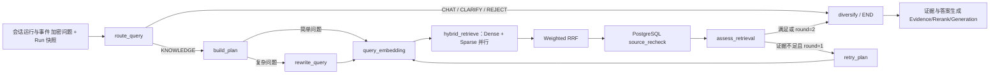

# 查询规划与混合检索 架构与边界

## 分层职责

| 层               | 代码                                           | 只负责                      | 不负责         |
| ---------------- | ---------------------------------------------- | --------------------------- | -------------- |
| Contract         | `libs/contracts/src/retrieval.ts`              | Zod 数据形状                | 路由算法、SQL  |
| Domain algorithm | `libs/retrieval/src/*`                         | 字面量、Filter、RRF、多样性 | Nest、Provider |
| Port             | `libs/application/src/retrieval.ports.ts`      | 外部能力抽象                | 厂商配置       |
| Graph            | `libs/rag-graph/src/hybrid-retrieval.graph.ts` | 节点、边、状态、上限        | HTTP、具体 SDK |
| Adapter          | `model-gateway/persistence-*`                  | HTTP、Redis、PG、Milvus     | 业务路线选择   |
| HTTP             | `apps/rag-query-service/src/hybrid-retrieval`  | 可信输入/输出映射           | 解密、权限规则 |

## 双环境切换

外网和内网共享完全相同的图：

- `LLM_ADAPTER=openai-compatible` 可连接 DeepSeek；内网标准协议使用 `http`。
- `EMBEDDING_ADAPTER=fixture` 仅供 CI；内网必须改成真实 `http/openai-compatible`。
- `VECTOR_STORE_ADAPTER=memory` 仅供 test/CI；生产必须是 `milvus`。
- Endpoint、密钥、模型 ID、revision 和维度全部由环境变量提供。

切换 Provider 不修改 Query Plan、Filter、RRF 或 PG 复核代码。若 Embedding Profile/维度/revision 改变，
必须创建新 Collection/Manifest；会话运行与事件 创建 Run 时会拒绝不兼容的索引快照。
