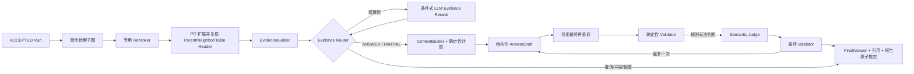

# 证据生成与答案校验：架构与链路

## 分层职责

- `libs/contracts`：跨进程 Zod 数据形状。
- `libs/application`：Reranker、Evidence Source、Answer Model、Telemetry Port。
- `libs/evidence`：不访问外部系统的证据、上下文和计算规则。
- `libs/answer`：不依赖 Nest/数据库/模型 SDK 的 Validator 与最终化。
- `libs/rag-graph`：固定控制流、一次重生成上限和执行用例。
- `libs/model-gateway`：DeepSeek/内网 HTTP/Fixture 协议、超时、取消、错误分类和版本检查。
- `libs/persistence-pg`：证据复核、引用、报告、反馈和 Run 租约事实。
- `apps/rag-query-service`：Nest 组装、调度、HTTP 与 Prometheus。

## 双环境切换

外网与内网共用上面全部业务层。变化只发生在配置选择的 Adapter：外网可以 Fixture Reranker 加
DeepSeek；内网使用 HTTP Reranker 和内网 LLM。OCR、Embedding、Milvus 已由前序模块独立配置，
答案图不读取供应商专有环境变量。
