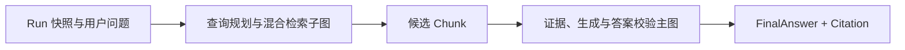

# 一次真实 LangGraph 问答：逐节点学习

## 1. 先看结果

本次真实 Run 为 `bb517acf-4c77-4207-aae5-75c3b9aa5610`。它读取 ACTIVE Manifest `3d40c37e-2d80-443a-a20c-755493f10066`，真实查询 Milvus，经过权限复核、专用 Reranker、证据扩展、生成、引用再鉴权和两层校验，最终得到 `ANSWERED / PASS`。

本机没有 DeepSeek API Key，所以三个模型 Port 使用确定性 fixture。学习时要把两个结论分开：

1. 工作流、权限、状态、存储、引用和校验链已经真实跑通；
2. fixture 只生成通用答案，不能证明真实模型能准确表达“部门负责人 + 财务负责人 + 十个工作日”。

## 2. 两层 Graph 为什么要分开

检索子图解决“去哪里找、怎么找、找到哪些候选”；答案主图解决“这些候选能否成为证据、是否允许回答、答案能否发布”。分层后可以独立替换检索算法或生成模型，也能阻止 LLM 绕过权限和确定性门禁。

代码入口：

- `libs/rag-graph/src/hybrid-retrieval.graph.ts`
- `libs/rag-graph/src/answer-generation.graph.ts`
- `libs/rag-graph/src/answer-generation.execution.service.ts`

## 3. Run 创建之前发生了什么

`POST /api/v1/conversations/{conversationId}/runs` 不会立即在 Controller 内执行模型。它先完成：

1. 解析用户身份 `user_id + roles`；
2. 把请求空间与当前 ACL 求交集，权限默认拒绝；
3. 锁定每个空间当时的 ACTIVE Manifest；
4. 冻结 Embedding、Reranker、LLM、Validator、检索参数和 Feature Flag revision；
5. 用 AES-256-GCM 保存问题正文，只在服务端 Graph 内解密；
6. 以 `Idempotency-Key` 创建一次逻辑 Run，返回 `202 ACCEPTED`；
7. 后台调度器领取 Run，把状态改为 `RUNNING` 后调用 Answer Graph。

这一步解决企业系统最常见的“执行一半配置被修改，结果无法复现”问题。面试追问通常是：为什么不直接读当前环境变量？答案是 Run 必须可重放，热配置只能影响下一次 Run。

## 4. 查询规划与混合检索子图

真实 Run 的检索结果是：`KNOWLEDGE`、确定性 Plan、1 轮、Dense 命中 8、最终候选 3。fixture Embedding 不支持 Sparse，所以 Sparse 路线明确降级而不是伪装成功。

### 4.1 `route_query`

- 输入：解密后的问题、有限会话实体；
- 输出：`CHAT / KNOWLEDGE / CLARIFY / REJECT`，以及金额、日期、版本、编号等精确字面量；
- 本次输出：`KNOWLEDGE`，识别 `AMOUNT`；
- 解决的问题：闲聊、缺范围问题和知识问答不能都直接打向量库；精确金额不能在 LLM 改写时丢失；
- 设计取舍：路由是确定性代码，不让 LLM 决定权限或拒答。

面试追问：LLM 路由是不是更聪明？可能更灵活，但不可复现、可被 Prompt Injection 影响，且不能承担安全决策；可把 LLM 作为建议，最终路线仍由规则约束。

### 4.2 `build_plan`

- 输入：Route、Run 中冻结的 Manifest、当前再次收窄后的空间、检索 Profile；
- 输出：服务端编译的 Milvus Filter、子问题、TopK、RRF 权重、计划 Hash；
- 解决的问题：用户输入不能直接拼接 Milvus Filter；一次 Run 的多个 Manifest 必须使用兼容的 Embedding Profile；
- 本次输出：`hybrid-medium-v1`，Plan Hash `9a21ada526f46595e3f9df239fe99d439a7f753eda25d7b8d5b671a5762a6ad3`。

面试追问：为什么保存 Plan Hash 而不是完整问题？Hash 可用于审计与缓存键，又避免在日志/调试响应泄露敏感正文；完整计划只在受控运行边界使用。

### 4.3 `rewrite_query`（本次跳过）

- 进入条件：问题需要消歧、拆分或结合有限会话实体；
- 输出：最多 4 个受控子问题；金额、编号等精确字面量继续保留；
- 失败策略：降级使用确定性原问题计划，不扩大空间和过滤范围；
- 本次原因：原问题已经明确，不需要 LLM 改写。

面试追问：改写服务 5xx 怎么办？改写是增强项，失败可降级；Embedding 或所有检索路线失败才是主链阻断。

### 4.4 `query_embedding`

- 输入：Plan 子问题、冻结的 Embedding Profile/Revision、Deadline/AbortSignal；
- 输出：Dense/Sparse 查询向量；
- 解决的问题：查询向量必须和索引向量维度、模型 revision、归一化规则一致；
- 本次结果：查询缓存命中；Dense 维度 1,024，Sparse 为 `null`。

缓存键同时包含 Profile、Revision、Plan Hash、权限范围 Hash 和问题 Hash。这样撤权、模型升级或计划变化都不会误复用旧缓存。

### 4.5 `hybrid_retrieve`

- 输入：查询向量、每个冻结 Manifest、服务端 Filter、TopK；
- 输出：Dense/Sparse 各路线结果和加权 RRF 融合列表；
- 本次结果：Dense 真实命中 8；Sparse 为 `SPARSE_NOT_CONFIGURED`；
- 解决的问题：单一路线失败时仍可有限降级，所有路线都失败才返回 `RETRIEVAL_UNAVAILABLE`；
- 设计取舍：RRF 使用排名而不是直接混合不同模型的原始分数，跨路线更稳定。

面试追问：为什么本次是 degraded 但还能回答？“降级”描述服务质量，不等于证据无效。Dense 成功且后续证据门禁通过时可以回答，但必须把降级事实写入结果和指标。

### 4.6 `source_recheck`

- 输入：融合后的最小向量命中、Run Manifest、当前 ACL、时间点；
- 输出：从 PostgreSQL hydrate 的 Chunk 正文，以及按撤权、删除、版本、生效期移除的统计；
- 解决的问题：Milvus 不是权限和正文真相源，命中后必须回 PG 重新鉴权；
- 本次结果：没有候选被移除。

面试追问：为什么检索前已经做 ACL，检索后还要再做？两次检查防 TOCTOU：Run 创建后可能撤权，向量库也可能短暂残留旧数据。

### 4.7 `assess_retrieval` / `retry_plan`（本次未重试）

- 判断：当前候选是否少于 `minimumResults`，且轮次是否小于 `maxRounds`；
- 重试输出：第二轮更宽但仍受同一权限 Filter 约束的计划；
- 本次结果：已得到至少 3 个候选，一轮结束；
- 解决的问题：证据不足时有限重试，同时用最大轮次防止无限 Agent 循环。

### 4.8 `diversify`

- 输入：一至两轮累积候选；
- 输出：限制每文档、每章节占比后的 Final TopK；
- 本次输出：3 个候选；
- 解决的问题：相邻 Chunk 或单一文档不能霸占全部上下文，提升来源覆盖。

检索子图的各节点通过 Metrics 计时；数据库中的 `rag_run_steps` 目前把整个子图记为外层 `answer_retrieve`。管理员可以用 `retrieval-debug` 查看脱敏排名、路线和移除统计，但看不到问题或 Chunk 正文。

## 5. 证据、生成与答案校验主图

### 5.1 `answer_retrieve`

- 输入：`runId`、当前用户上下文、Run Deadline、取消信号；
- 输出：检索 Route、候选、Run 快照和降级标记；
- 本次：514 ms，3 个候选，`degraded=true`；
- 企业价值：主图复用受控检索子图，不自己访问 Milvus 或拼 Filter。

### 5.2 `answer_rerank`

- 输入：问题和候选的 title/displayContent，最多到配置上限；
- 输出：专用 Reranker 排名和冻结 revision；
- 本次：3 进 3 出，11 ms；
- 安全点：返回 revision 必须同时匹配 Run 快照和启动配置；运营性 429/5xx 才允许按 Feature Flag 回退，Schema/版本错误不能回退掩盖。

面试追问：为什么不用生成 LLM 顺便打分？专用 Reranker 更便宜、更稳定、可批处理，且职责和失败策略清晰。

### 5.3 `answer_expand_evidence`

- 输入：Rerank 后候选、Manifest、当前允许空间、Run 创建时间；
- 输出：Self、Parent、Neighbor、Table Header 等扩展材料；
- 本次：94 ms；
- 解决的问题：向量命中的 Child Chunk 可能缺标题、表头或上下文；扩展必须从 PG 取并再次鉴权，不能相信 Milvus 短摘要。

### 5.4 `answer_build_evidence`

- 输入：候选、扩展材料、Reranker 分数、子问题；
- 输出：10 条不透明 `sourceId`、覆盖率、权威度、冲突、置信度和 Bundle Hash；
- 本次：12 ms，10 条来源；
- 解决的问题：生成模型只能看到已经结构化、可追踪的 Evidence Bundle。

真实演练修正了冲突算法：只有同一子问题、同一末级章节、不同文档版本的可比字面量才构成冲突。同一制度不同章节出现 650 元、5,000 元、20,000 元属于不同规则，不能误杀。

### 5.5 `answer_route_evidence`

- 输入：检索 Route、覆盖、冲突、置信度、轮次和是否已做 LLM Evidence Rerank；
- 输出：`ANSWER / PARTIAL_ANSWER / LLM_RERANK / REWRITE_AND_RETRY / CLARIFY / CONFLICT / REJECT`；
- 本次：`ANSWER`；
- 解决的问题：LLM 没有“是否准许回答”的决定权。冲突、无证据或需澄清时直接走受控终态。

第一条真实 Run 因旧冲突规则走 `CONFLICT → finalize`，没有调用生成模型。这说明短路保护实际生效，而不是只存在于测试。

### 5.6 `answer_llm_evidence_rerank`（本次跳过）

只有证据部分覆盖或置信度低时进入，而且最多一次。它只能重排现有 `sourceId`，不能创造新来源、放宽 ACL 或修改 Manifest。

### 5.7 `answer_build_context`

- 输入：Evidence Bundle；
- 输出：受 Token Budget、每文档上限约束的上下文，以及白名单确定性计算；
- 本次：11 ms；
- 安全点：证据包装为 `untrusted_data` 并转义边界字符，文档中的“忽略系统提示”只能作为数据。

### 5.8 `answer_generate_draft`

- 输入：问题、Evidence Route、受控上下文、确定性计算、可选修复指令；
- 输出：结构化 Draft、Claim 和 Citation 引用；
- 本次：fixture 生成 attempt 1，11 ms；
- 限制：fixture 只输出通用正文和首个引用，不代表 DeepSeek 的业务表达质量。

### 5.9 `answer_revalidate_citations`

- 输入：Draft 引用的 Evidence Source；
- 输出：当前仍授权、仍有效的 `sourceId`；
- 本次：28 ms；
- 解决的问题：生成期间也可能撤权或文档失效；答案落库前必须最后再鉴权。

面试追问：如果引用在生成后撤权怎么办？Validator 会把失效引用判为阻断问题，答案不能以普通成功正文发布。

### 5.10 `answer_rule_validation`

- 输入：Draft、Bundle、确定性计算、当前有效引用、Validator Profile；
- 输出：确定性问题列表和 `PASS / REGENERATE / REJECT`；
- 本次：`PASS`，18 ms；
- 检查：引用存在性、Claim 支持、计算一致性、失效来源、证据冲突等。

### 5.11 `answer_semantic_judge`（本次跳过）

只有确定性规则无法判断的语义 Claim 才调用模型 Judge。它不能覆盖确定性阻断项。本次 fixture Draft 没有需要 Judge 的语义 Claim，所以直接进入最终校验。

### 5.12 `answer_final_validation`

- 输入：规则报告和可选 Semantic Judge；
- 输出：最终 Validator 结论；
- 本次：`PASS`，10 ms；
- 循环边界：`REGENERATE` 最多再生成一次；第二份草稿仍失败就强制 `REJECT`，防止无限循环和成本失控。

### 5.13 `answer_finalize`

- 输入：Evidence Route、Bundle、Draft、最终校验；
- 输出：唯一可对客户端公开的 `FinalAnswer`；
- 本次：`ANSWERED`，16 ms；
- 解决的问题：流式阶段只发进度事件，未经校验的 Draft 不会提前泄漏给前端。

## 6. 引用为何可信

最终 Citation `925fd539-d4b1-4239-b1d8-2b2edd7a3b31` 不是客户端拼接的 URL。读取 Citation API 时会再次验证 owner、空间权限、Manifest、生效期和来源状态，再从 PG 返回最小 excerpt。

本次 excerpt 明确包含：

- 6,000 元超过 5,000 元但未超过 20,000 元；
- 直属部门负责人先审批；
- 财务负责人复核预算；
- 返程后十个工作日内提交报销。

因此可以说“检索和证据链找对了”，不能说“fixture 最终正文已经完整回答了业务问题”。换成内网 LLM 后，黄金集应把这两个事实写成必含 Claim，并校验 Claim 到 Citation 的支持关系。

## 7. 本次最值得记住的四个落地教训

1. SDK 构造器也可能产生异步网络副作用；异常必须回到可 `await` 的 Port 边界。
2. 跨语言/跨数据库字段长度要明确是字符、UTF-16 代码单元还是 UTF-8 字节。
3. “检测到不同数字”不等于“证据冲突”；必须先限定语义比较范围和权威来源单位。
4. Outbox 会投递命令，也会投递生命周期通知；消费者必须区分执行、投影和只落收据的事件。

## 8. 面试时用一分钟讲清楚

可以这样回答：

> 我们把 RAG 拆成检索子图和证据答案主图。Run 创建时冻结 Manifest、模型 revision、检索参数、Feature Flag 和权限版本；检索前后都做 ACL 收窄，Milvus 只存向量和短摘要，正文回 PG 读取。候选经专用 Reranker 后扩展成 Evidence Bundle，由确定性 Router 决定回答、澄清、冲突或拒答。生成后再次校验引用权限，再做规则校验和必要的 Semantic Judge，最多修复生成一次，只有 FinalAnswer 能对外发布。这样解决了可复现、撤权即时生效、幻觉、引用失效、配置热变和无限 Agent 循环问题。

追问“本次真实跑了什么”时，回答具体事实：Dense Milvus 命中 8、最终候选 3、扩展证据 10、Router 为 `ANSWER`、Validator 为 `PASS`、最终 `ANSWERED`；Sparse 和模型质量因 fixture 没有冒充验收通过。
