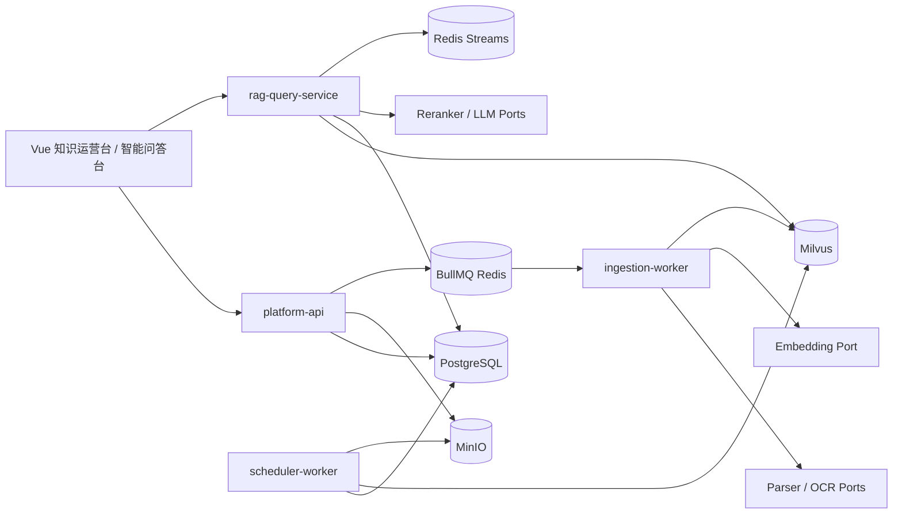

# 企业级 RAG 知识库产品需求文档

> 状态：需求基线 v1.0  
> 规模假设：中型企业  
> 部署路径：外网开发验证 → 内网配置切换 → 预生产验收 → 生产上线

## 1. Executive Summary

### Problem Statement

企业内部的制度、流程、产品、技术和运营知识分散在多种文档中，传统关键词搜索无法稳定处理自然语言、版本、生效范围、表格和跨文档问题，也无法证明答案来自何处。项目需要建设一个可审计、可回滚、权限安全、能够拒答并且可持续评测的企业级 RAG 知识库。

### Proposed Solution

建设由知识运营台、智能问答台、文档入库流水线、混合检索与答案校验引擎组成的平台。PostgreSQL 保存业务事实，MinIO 保存文件，Milvus 保存可重建的检索投影，Redis/BullMQ 支撑任务和事件，模型能力全部经可配置 Port 接入，使外网开源环境和内网模型服务使用相同业务代码。

### Success Criteria

以下是初始上线门槛，必须用版本化评测集和压测报告证明：

| 指标                     |                                   门槛 |
| ------------------------ | -------------------------------------: |
| Answerable Recall@40     |                                  ≥ 95% |
| Hit@5                    |                                  ≥ 88% |
| Citation Precision       |                                  ≥ 98% |
| Unsupported Claim Rate   |                                   ≤ 1% |
| 无答案正确拒答率         |                                  ≥ 90% |
| 版本/生效范围正确率      |                                  ≥ 98% |
| 权限泄漏率               |                                      0 |
| Run 创建及首状态事件 P95 |                                ≤ 200ms |
| 普通问题完整响应 P95     |                                   ≤ 8s |
| 复杂问题完整响应 P95     |                                  ≤ 15s |
| 月度服务可用性目标       | ≥ 99.9%（内外部依赖口径在 SLO 中定义） |

### 中型规模工程基线

下列数据用于设计、测试和容量估算，不是未经压测的生产承诺：

| 维度               |             初始设计基线 |
| ------------------ | -----------------------: |
| 注册/可识别用户    |                  ≤ 5,000 |
| 日活用户           |                  ≤ 1,000 |
| 同时在线 SSE 连接  |        200，短时峰值 400 |
| 问答流量           | 稳态 10 QPS，短时 20 QPS |
| 知识空间           |                    ≤ 200 |
| 逻辑文档           |                ≤ 100,000 |
| 有效 Chunk         |              ≤ 5,000,000 |
| 日新增或重处理文档 |                  ≤ 1,000 |
| 单文件默认上限     |          200 MiB，可配置 |
| 单次批量上传       |       100 个文件，可配置 |
| 原始及派生对象存储 |   2 TiB 起步，按监控扩容 |

上线前必须用实际硬件和模型吞吐重新校准这些参数。

## 2. User Experience & Functionality

### User Personas

| 用户           | 默认语义角色         | 主要目标                                            |
| -------------- | -------------------- | --------------------------------------------------- |
| 普通知识使用者 | `KNOWLEDGE_READER`   | 提问、查看引用、继续追问、提交反馈                  |
| 知识维护者     | `KNOWLEDGE_EDITOR`   | 创建知识空间、上传和维护文档、发起重处理            |
| 内容审核者     | `KNOWLEDGE_REVIEWER` | 检查解析质量、Chunk、版本和生效范围，批准或拒绝发布 |
| 知识管理员     | `KNOWLEDGE_ADMIN`    | 配置空间策略、角色授权、模型与流程 Profile          |
| 系统管理员     | `SYSTEM_ADMIN`       | 管理系统配置、故障处理、容量和发布                  |
| 审计人员       | `AUDITOR`            | 只读查询操作日志、问答依据、版本和安全事件          |

内网实际角色名称通过配置映射到上述语义角色，不要求认证系统采用相同字符串。

### User Stories

#### US-01 登录与权限

作为企业用户，我希望系统使用内网身份中的 `userId` 和 `roles` 自动识别我，使我只能访问被角色或个人授权的知识空间和文档。

验收条件：

- 外网 Mock、可信 Header、JWT 三种模式通过统一 `AuthPort` 切换。
- 客户端提交的角色、用户或知识空间不能扩大服务端解析出的权限。
- 未认证、角色无效和认证服务异常时默认拒绝访问。
- 引用预览、历史消息和缓存命中都重新执行当前权限检查。

#### US-02 知识空间管理

作为知识管理员，我希望创建知识空间并配置负责人、授权角色、文档规则和 RAG 策略，使不同知识主题能够独立治理。

验收条件：

- 支持创建、查询、更新、停用和审计知识空间。
- 支持按用户或角色授权读取、维护、审核和管理权限。
- 策略修改有版本，新 Run 和新入库任务锁定使用的策略版本。

#### US-03 批量上传和真实处理进度

作为知识维护者，我希望批量上传文档并看到每个文件从上传到发布的真实进度，使我知道系统当前在做什么以及失败后如何处理。

验收条件：

- 浏览器使用预签名 URL 直传 MinIO，支持多文件、取消、失败重传和大文件分片。
- 分别展示网络上传进度与后端处理进度，不将二者混成一个假百分比。
- 后端进度至少覆盖安全扫描、解析、OCR、标准化、Chunk、质量检查、审核等待、Embedding、索引、验证和发布。
- 每个步骤显示状态、已处理量/总量、耗时、最近消息和稳定错误码。
- 页面刷新或重新登录后仍能恢复任务进度；事件断开时自动续传或降级轮询。

#### US-04 解析检查与人工审核

作为审核者，我希望对照原文查看解析块、页码、表格、OCR 置信度和 Chunk，使低质量或错误内容不会进入正式索引。

验收条件：

- 支持 PDF、DOCX、XLSX、PPTX、图片、HTML、Markdown、TXT 和 CSV 的配置化格式路由。
- 原文预览与 Block/Chunk 可以互相定位。
- 展示质量报告、失败表格、缺页、乱码、重复和版本冲突。
- 审核动作包含通过、拒绝、要求重处理和填写原因，并完整审计。

#### US-05 安全发布与回滚

作为知识管理员，我希望新版本只有在索引对账和关键查询验证通过后才对用户可见，并能够回退到上一版本。

验收条件：

- 文档业务版本、内容修订、Embedding 修订和空间发布清单分开版本化。
- 发布切换是原子的；构建中和验证失败的索引不可见。
- 文档废止、撤权和回滚能够使新请求立即按最新有效状态过滤。
- 派生数据异步清理失败不影响当前正确性，并能被对账任务发现。

#### US-06 有依据的智能问答

作为普通用户，我希望用自然语言询问企业知识并看到可点击引用，使我能够核实答案。

验收条件：

- 支持会话、流式状态、取消、断线续传和历史记录。
- 支持简称、错别字、错误码、金额、日期、版本、口语指代和多跳问题。
- 答案 Claim 必须绑定当前用户可读的 Evidence；引用能够定位文档版本和页面。
- 证据不足时澄清、部分回答或拒答，证据冲突时明确展示冲突来源。
- 严格模式不向前端输出未经校验的答案正文。

#### US-07 检索调试与质量评测

作为知识管理员或开发者，我希望使用检索测试台查看 Query Plan、召回、排序、过滤和引用结果，使检索质量能够被解释和持续改进。

验收条件：

- 可以输入问题、空间、时间和检索 Profile，查看 Dense、Sparse、RRF、Rerank 的阶段结果。
- 不向无管理权限用户暴露隐藏候选、权限表达式或完整 Prompt。
- 评测集、基线和结果版本化，模型、Chunk、Prompt 或检索参数变更必须执行回归。

#### US-08 运维与审计

作为系统管理员或审计人员，我希望查看健康、积压、错误、耗时、发布和访问日志，使故障能够定位、恢复并复盘。

验收条件：

- 关键调用具有结构化日志、指标和分布式 Trace。
- 提供卡住任务、DLQ、索引不一致、模型超时、SSE 激增和备份恢复 Runbook。
- 审计记录包含操作者、动作、目标、结果、版本和时间，但不泄漏敏感正文和密钥。

### Non-Goals

- 不建设 SaaS 多租户、公开注册、计费或企业间数据隔离能力。
- 首版不依据部门、组织树、地区或员工级别授权；权限只使用 `userId`、`roles` 和知识资源授权关系。
- 不建设通用自主 Agent、外部工具执行市场或低代码工作流编辑器。
- 不提供在线文档协同编辑，原文维护仍由既有办公系统或文件负责。
- 不承诺任何第三方云模型永久免费；“免费能力”指可本地部署的开源实现。
- 不允许前端直接修改生产 Prompt、模型密钥或底层 Collection 名称。

## 3. AI System Requirements

### Tool Requirements

| 能力      | 外网开发默认                              | 内网目标                | 接口约束                                    |
| --------- | ----------------------------------------- | ----------------------- | ------------------------------------------- |
| LLM       | 用户的 DeepSeek Pro/OpenAI-compatible API | 内部 Model Gateway      | 结构化输出、超时、取消、Profile 版本        |
| Embedding | 本地开源 BGE-M3 服务或测试 Stub           | 内网 Embedding 服务     | 文档/查询端点分离、Dense+Sparse、元数据握手 |
| Reranker  | 本地开源 bge-reranker-v2-m3 或 Stub       | 内网 Reranker 服务      | 批量排序、分数校准版本                      |
| OCR       | 本地 PaddleOCR 类服务或 Fixture           | 内网 OCR 服务           | 按页、坐标、置信度、引擎版本                |
| 向量库    | Docker Compose Milvus Standalone          | 内网 Milvus 集群        | 混合检索、参数化过滤、Profile Alias         |
| Parser    | 本地 Parser Runtime                       | 内网隔离 Parser Runtime | 统一 DocumentBlock，不直接产出最终 Chunk    |

所有能力经 TypeScript Port 调用；供应商 SDK 和环境变量只存在于 Adapter/Config 层。

### Evaluation Strategy

- 建立公开或脱敏的固定文档集，覆盖文本 PDF、扫描 PDF、Word、Excel 合并表头、PPT 图文、图片、HTML/MD/TXT、损坏与恶意文件。
- 建立至少 200 条首期 Golden Questions；正式上线前按实际业务域扩充，其中包含无答案、冲突、过期版本、跨权限、精确金额/日期和 Prompt Injection。
- 解析评测检查 Block 顺序、页码、坐标、表格结构、OCR 置信度和 Chunk Snapshot。
- 检索评测检查 Recall@40、Hit@5、MRR、版本与权限正确性。
- 答案评测检查 Claim 支撑、Citation Precision、拒答、冲突和确定性字段一致性。
- 非确定模型任务重复运行，保存均值、方差和失败样本；阻断规则不能被语义 Judge 覆盖。
- 每个 Profile、Prompt、Chunker 和 Flow 都保存版本，评测结果必须能还原当时配置。

## 4. Technical Specifications

### Architecture Overview

核心事实规则：

- PostgreSQL 是文档状态、发布清单、Chunk 正文、问答和审计的事实源。
- Milvus 是可重建的检索投影，不保存完整正文，不单独决定可见性。
- MinIO 保存原文件和派生文件，业务状态不以对象是否存在代替。
- BullMQ 是执行通道，任务事实状态必须落 PostgreSQL。
- Redis Stream 是 Run 事件通道，最终答案必须先持久化再发送完成事件。

### Integration Points

- 认证：`mock`、`trusted-header`、`jwt` 三种模式，共用 `AuthPort`。
- 数据库：PostgreSQL + Prisma；高级索引、分区和可选 RLS 使用 SQL Migration。
- 对象：MinIO 预签名上传、HEAD 校验、隔离与生命周期。
- 队列：独立 Redis 上的 BullMQ；在线缓存和 Streams 使用另一 Redis 逻辑实例或独立部署。
- 向量：Milvus Dense + Sparse 混合检索。
- AI：Embedding、Reranker、OCR、LLM 均使用配置化 HTTP Port 和能力握手。
- API：REST + OpenAPI；长任务和问答事件使用 SSE，支持 `Last-Event-ID`。
- 前端：Vue 3 + TypeScript + Element Plus；AI 组件经 Element Plus X Adapter 使用。

### Security & Privacy

- 单企业部署仍必须执行最小权限、角色/个人资源授权和引用二次鉴权。
- 可信 Header 模式只能部署在会清除外部同名 Header 的受信反向代理之后。
- JWT 必须验证签名、Issuer、Audience、过期时间和允许算法。
- 文件先进入隔离 Bucket，经魔数、MIME、Hash、恶意软件和资源限制检查后才能解析。
- Parser 容器无外网、只读根文件系统、最小权限，并限制 CPU、内存、临时盘和执行时间。
- Prompt 中来源内容明确标识为数据；生成服务不得拥有数据库、对象存储或系统工具权限。
- 日志、Trace 和前端不保存密钥、长期 Token、预签名 URL、完整敏感问题、系统 Prompt 或隐藏候选。
- 删除采用可审计状态迁移，再异步清除对象、向量、缓存和超期审计派生数据。

### 发布清单语义

必须明确区分以下版本，避免发布单个文档导致其他文档从检索中消失：

| 版本                   | 粒度                 | 用途                              |
| ---------------------- | -------------------- | --------------------------------- |
| `documentVersionId`    | 单逻辑文档           | 不可变业务版本                    |
| `contentRevision`      | 单文档版本           | Parser/Chunker 重处理修订         |
| `embeddingRevision`    | 单内容修订 + Profile | 向量生成事实                      |
| `spaceManifestVersion` | 知识空间             | 当前可见文档版本成员集合/发布快照 |
| `embeddingProfileId`   | 模型兼容空间         | 决定 Collection/Alias 和向量维度  |

检索以当前空间 Manifest 中的有效文档成员和 Profile 为准，不把“最近发布的一个文档 revision”误当作整个空间唯一内容 revision。具体表结构在 M05 ADR 中冻结。

## 5. Risks & Roadmap

### Phased Rollout

这里的阶段不是删减最终需求，而是将全量目标按依赖逐步交付：

| 阶段                 | 模块     | 可验证结果                               |
| -------------------- | -------- | ---------------------------------------- |
| Foundation           | M00～M02 | 工程、权限、知识空间、上传和任务事实闭环 |
| Knowledge Production | M03～M05 | 文档从隔离区到审核、索引、发布和回滚闭环 |
| RAG Runtime          | M06～M08 | Run、SSE、检索、证据、生成和校验闭环     |
| Product & Production | M09～M10 | 前端、评测、压测、运维、安全与总验收闭环 |

每个模块先在外网开发环境完成，然后在内网用相同契约更换 Provider Adapter 并执行兼容性测试。

### Product Interaction References

以下产品仅作为信息架构与交互研究参考，不作为代码依赖，也不照搬其视觉：

- [Element Plus X](https://v2.element-plus-x.com/zh/guide/introduce.html)：会话、消息气泡、输入器和流式交互组件。
- [RAGFlow Dataset Configuration](https://ragflow.net/docs/configure_knowledge_base)：知识库配置、格式化解析、解析结果干预和检索测试闭环。
- [Dify Knowledge Retrieval](https://docs.dify.ai/guides/knowledge-base/retrieval)：知识库与应用编排的信息组织方式。
- [FastGPT Quick Start](https://doc.fastgpt.io/en/guide/getting-started/quick-start)：上传、解析参数、知识库和问答的渐进流程。

本项目的差异化重点是：真实入库步骤进度、强制人工质量门禁、空间发布 Manifest、Claim 级引用校验和生产故障恢复。

### Technical Risks

| 风险                     | 影响                       | 控制措施                                                          |
| ------------------------ | -------------------------- | ----------------------------------------------------------------- |
| 内网认证协议未知         | 无法直接联调登录           | 三模式 Auth Adapter；M01 用 Mock 完成，内网信息确定后新增契约测试 |
| 内外网模型协议差异       | 切换时大量改业务代码       | Port + Zod 契约 + Profile + `/metadata` 能力握手                  |
| 复杂 PDF/表格解析不稳定  | 错误知识进入索引           | 格式专用 Parser、质量门禁、人工审核、真实 Golden 文档             |
| Embedding Profile 不兼容 | 检索错误或索引不可用       | 启动检查维度/Revision；不兼容 Profile 使用新 Collection           |
| Manifest 粒度设计错误    | 发布新文档后旧文档不可见   | M05 前完成发布语义 ADR 和全空间回归测试                           |
| Element Plus X API 变化  | 问答页面升级成本           | 固定 lockfile、封装 Adapter、组件契约测试                         |
| 逐字流式输出先于校验     | 用户看到后又无法撤回的错误 | 严格模式仅发阶段事件，校验后再输出正文                            |
| “免费外部能力”性能不足   | 外网联调慢或无法压测       | 功能测试用本地实现/Stub；性能结论只以内网目标硬件压测为准         |
| 注释过量导致代码噪声     | 学习和维护效果反而下降     | 源码解释设计与关键逻辑，逐行讲解进入配套 walkthrough              |
